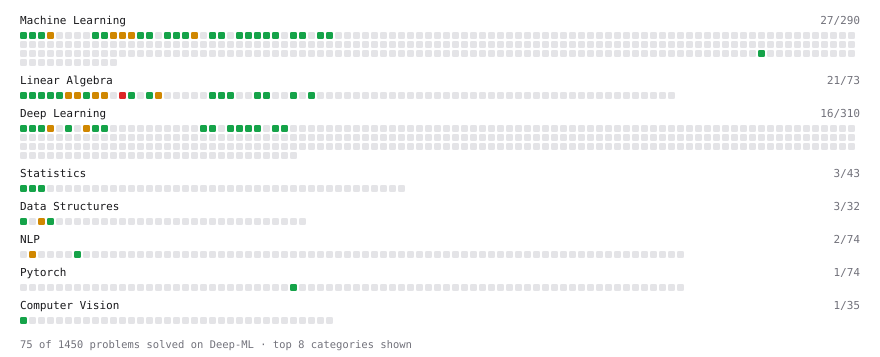

# Deep-ML

My machine learning practice from [Deep-ML](https://www.deep-ml.com). Every solution here was written by hand.

**91** solved · 91 problems · 0 labs · 0 math

[**Browse the interactive portfolio**](https://0xAriseAizen-404.github.io/deep-ml/) to replay this filling in over time.

## Problems

| | Difficulty | Solved | |
| --- | --- | --- | --- |
| [Batch Iterator for Dataset](https://www.deep-ml.com/problems/30) | easy | 2026-07-23 | [solution](problems/0030-batch-iterator-for-dataset) |
| [Bhattacharyya Distance Between Two Distributions](https://www.deep-ml.com/problems/120) | easy | 2026-09-15 | [solution](problems/0120-bhattacharyya-distance-between-two-distributions) |
| [Binary Classification with Logistic Regression](https://www.deep-ml.com/problems/104) | easy | 2026-08-11 | [solution](problems/0104-binary-classification-with-logistic-regression) |
| [Calculate 2x2 Matrix Inverse](https://www.deep-ml.com/problems/8) | easy | 2026-07-15 | [solution](problems/0008-calculate-2x2-matrix-inverse) |
| [Calculate Accuracy Score](https://www.deep-ml.com/problems/36) | easy | 2026-07-27 | [solution](problems/0036-calculate-accuracy-score) |
| [Calculate Cosine Similarity Between Vectors](https://www.deep-ml.com/problems/76) | easy | 2026-07-31 | [solution](problems/0076-calculate-cosine-similarity-between-vectors) |
| [Calculate Covariance Matrix](https://www.deep-ml.com/problems/10) | easy | 2026-07-16 | [solution](problems/0010-calculate-covariance-matrix) |
| [Calculate Dice Score for Classification](https://www.deep-ml.com/problems/73) | easy | 2026-08-03 | [solution](problems/0073-calculate-dice-score-for-classification) |
| [Calculate F1 Score from Predicted and True Labels](https://www.deep-ml.com/problems/91) | easy | 2026-08-04 | [solution](problems/0091-calculate-f1-score-from-predicted-and-true-labels) |
| [Calculate Image Brightness](https://www.deep-ml.com/problems/70) | easy | 2026-08-03 | [solution](problems/0070-calculate-image-brightness) |
| [Calculate Jaccard Index for Binary Classification](https://www.deep-ml.com/problems/72) | easy | 2026-08-03 | [solution](problems/0072-calculate-jaccard-index-for-binary-classification) |
| [Calculate Mean Absolute Error (MAE)](https://www.deep-ml.com/problems/93) | easy | 2026-08-04 | [solution](problems/0093-calculate-mean-absolute-error-mae) |
| [Calculate Mean by Row or Column](https://www.deep-ml.com/problems/4) | easy | 2026-07-15 | [solution](problems/0004-calculate-mean-by-row-or-column) |
| [Calculate R-squared for Regression Analysis](https://www.deep-ml.com/problems/69) | easy | 2026-08-03 | [solution](problems/0069-calculate-r-squared-for-regression-analysis) |
| [Calculate Root Mean Square Error (RMSE)](https://www.deep-ml.com/problems/71) | easy | 2026-07-30 | [solution](problems/0071-calculate-root-mean-square-error-rmse) |
| [Calculate the Phi Coefficient](https://www.deep-ml.com/problems/95) | easy | 2026-08-10 | [solution](problems/0095-calculate-the-phi-coefficient) |
| [Calculate Unigram Probability from Corpus](https://www.deep-ml.com/problems/129) | easy | 2026-08-12 | [solution](problems/0129-calculate-unigram-probability-from-corpus) |
| [Compute the Cross Product of Two 3D Vectors](https://www.deep-ml.com/problems/118) | easy | 2026-08-12 | [solution](problems/0118-compute-the-cross-product-of-two-3d-vectors) |
| [Compute TPR and FPR from Classifications](https://www.deep-ml.com/problems/1217) | easy | 2026-07-27 | [solution](problems/1217-compute-tpr-and-fpr-from-classifications) |
| [Convert RGB Image to Grayscale](https://www.deep-ml.com/problems/237) | easy | 2026-08-16 | [solution](problems/0237-convert-rgb-image-to-grayscale) |
| [Convert Vector to Diagonal Matrix](https://www.deep-ml.com/problems/35) | easy | 2026-07-27 | [solution](problems/0035-convert-vector-to-diagonal-matrix) |
| [Count Parameters of a Sequential Model](https://www.deep-ml.com/problems/1218) | easy | 2026-07-29 | [solution](problems/1218-count-parameters-of-a-sequential-model) |
| [Derivative of a Polynomial](https://www.deep-ml.com/problems/116) | easy | 2026-08-11 | [solution](problems/0116-derivative-of-a-polynomial) |
| [Descriptive Statistics Calculator](https://www.deep-ml.com/problems/78) | easy | 2026-08-03 | [solution](problems/0078-descriptive-statistics-calculator) |
| [Detect Overfitting or Underfitting](https://www.deep-ml.com/problems/86) | easy | 2026-08-04 | [solution](problems/0086-detect-overfitting-or-underfitting) |
| [Dot Product Calculator](https://www.deep-ml.com/problems/83) | easy | 2026-08-03 | [solution](problems/0083-dot-product-calculator) |
| [Feature Scaling Implementation](https://www.deep-ml.com/problems/16) | easy | 2026-07-20 | [solution](problems/0016-feature-scaling-implementation) |
| [Generate a Confusion Matrix for Binary Classification](https://www.deep-ml.com/problems/75) | easy | 2026-07-31 | [solution](problems/0075-generate-a-confusion-matrix-for-binary-classification) |
| [Grayscale Image Contrast Calculator](https://www.deep-ml.com/problems/82) | easy | 2026-09-01 | [solution](problems/0082-grayscale-image-contrast-calculator) |
| [Implement a Simple Residual Block with Shortcut Connection](https://www.deep-ml.com/problems/113) | easy | 2026-08-11 | [solution](problems/0113-implement-a-simple-residual-block-with-shortcut-connection) |
| [Implement Compressed Column Sparse Matrix Format (CSC)](https://www.deep-ml.com/problems/67) | easy | 2026-07-31 | [solution](problems/0067-implement-compressed-column-sparse-matrix-format-csc) |
| [Implement Compressed Row Sparse Matrix (CSR) Format Conversion](https://www.deep-ml.com/problems/65) | easy | 2026-07-31 | [solution](problems/0065-implement-compressed-row-sparse-matrix-csr-format-conversion) |
| [Implement F-Score Calculation for Binary Classification](https://www.deep-ml.com/problems/61) | easy | 2026-07-30 | [solution](problems/0061-implement-f-score-calculation-for-binary-classification) |
| [Implement Gini Impurity Calculation for a Set of Classes](https://www.deep-ml.com/problems/64) | easy | 2026-09-01 | [solution](problems/0064-implement-gini-impurity-calculation-for-a-set-of-classes) |
| [Implement Global Average Pooling](https://www.deep-ml.com/problems/114) | easy | 2026-08-10 | [solution](problems/0114-implement-global-average-pooling) |
| [Implement Orthogonal Projection of a Vector onto a Line](https://www.deep-ml.com/problems/66) | easy | 2026-07-31 | [solution](problems/0066-implement-orthogonal-projection-of-a-vector-onto-a-line) |
| [Implement Precision Metric](https://www.deep-ml.com/problems/46) | easy | 2026-07-30 | [solution](problems/0046-implement-precision-metric) |
| [Implement Recall Metric in Binary Classification](https://www.deep-ml.com/problems/52) | easy | 2026-07-30 | [solution](problems/0052-implement-recall-metric-in-binary-classification) |
| [Implement ReLU Activation Function](https://www.deep-ml.com/problems/42) | easy | 2026-07-28 | [solution](problems/0042-implement-relu-activation-function) |
| [Implement Ridge Regression Loss Function](https://www.deep-ml.com/problems/43) | easy | 2026-07-30 | [solution](problems/0043-implement-ridge-regression-loss-function) |
| [Implement the ELU Activation Function](https://www.deep-ml.com/problems/97) | easy | 2026-08-04 | [solution](problems/0097-implement-the-elu-activation-function) |
| [Implement the Hard Sigmoid Activation Function](https://www.deep-ml.com/problems/96) | easy | 2026-08-04 | [solution](problems/0096-implement-the-hard-sigmoid-activation-function) |
| [Implement the SELU Activation Function](https://www.deep-ml.com/problems/103) | easy | 2026-08-11 | [solution](problems/0103-implement-the-selu-activation-function) |
| [Implement the Softplus Activation Function](https://www.deep-ml.com/problems/99) | easy | 2026-08-11 | [solution](problems/0099-implement-the-softplus-activation-function) |
| [Implement the Softsign Activation Function](https://www.deep-ml.com/problems/100) | easy | 2026-08-11 | [solution](problems/0100-implement-the-softsign-activation-function) |
| [Implement the Swish Activation Function](https://www.deep-ml.com/problems/102) | easy | 2026-08-11 | [solution](problems/0102-implement-the-swish-activation-function) |
| [Implementation of Log Softmax Function](https://www.deep-ml.com/problems/39) | easy | 2026-07-29 | [solution](problems/0039-implementation-of-log-softmax-function) |
| [Label Encoding for Ordinal Variables](https://www.deep-ml.com/problems/356) | easy | 2026-09-27 | [solution](problems/0356-label-encoding-for-ordinal-variables) |
| [Leaky ReLU Activation Function](https://www.deep-ml.com/problems/44) | easy | 2026-07-29 | [solution](problems/0044-leaky-relu-activation-function) |
| [Linear Kernel Function](https://www.deep-ml.com/problems/45) | easy | 2026-07-29 | [solution](problems/0045-linear-kernel-function) |
| [Linear Regression Using Gradient Descent](https://www.deep-ml.com/problems/15) | easy | 2026-07-18 | [solution](problems/0015-linear-regression-using-gradient-descent) |
| [Linear Regression Using Normal Equation](https://www.deep-ml.com/problems/14) | easy | 2026-07-18 | [solution](problems/0014-linear-regression-using-normal-equation) |
| [Matrix-Vector Dot Product](https://www.deep-ml.com/problems/1) | easy | 2026-07-14 | [solution](problems/0001-matrix-vector-dot-product) |
| [Min-Max Scaling of Feature Values](https://www.deep-ml.com/problems/112) | easy | 2026-08-10 | [solution](problems/0112-min-max-scaling-of-feature-values) |
| [One-Hot Encoding of Nominal Values](https://www.deep-ml.com/problems/34) | easy | 2026-07-27 | [solution](problems/0034-one-hot-encoding-of-nominal-values) |
| [Poisson Distribution Probability Calculator](https://www.deep-ml.com/problems/81) | easy | 2026-09-01 | [solution](problems/0081-poisson-distribution-probability-calculator) |
| [Random Shuffle of Dataset](https://www.deep-ml.com/problems/29) | easy | 2026-07-23 | [solution](problems/0029-random-shuffle-of-dataset) |
| [Reshape Matrix](https://www.deep-ml.com/problems/3) | easy | 2026-07-14 | [solution](problems/0003-reshape-matrix) |
| [Scalar Multiplication of a Matrix](https://www.deep-ml.com/problems/5) | easy | 2026-07-15 | [solution](problems/0005-scalar-multiplication-of-a-matrix) |
| [Sigmoid Activation Function Understanding](https://www.deep-ml.com/problems/22) | easy | 2026-07-20 | [solution](problems/0022-sigmoid-activation-function-understanding) |
| [Single Neuron](https://www.deep-ml.com/problems/24) | easy | 2026-07-23 | [solution](problems/0024-single-neuron) |
| [Softmax Activation Function Implementation ](https://www.deep-ml.com/problems/23) | easy | 2026-07-20 | [solution](problems/0023-softmax-activation-function-implementation) |
| [Transformation Matrix from Basis B to C](https://www.deep-ml.com/problems/27) | easy | 2026-07-27 | [solution](problems/0027-transformation-matrix-from-basis-b-to-c) |
| [Transpose of a Matrix](https://www.deep-ml.com/problems/2) | easy | 2026-07-14 | [solution](problems/0002-transpose-of-a-matrix) |
| [Vector Element-wise Sum](https://www.deep-ml.com/problems/121) | easy | 2026-08-12 | [solution](problems/0121-vector-element-wise-sum) |
| [2D Translation Matrix Implementation](https://www.deep-ml.com/problems/55) | medium | 2026-08-25 | [solution](problems/0055-2d-translation-matrix-implementation) |
| [Calculate Correlation Matrix](https://www.deep-ml.com/problems/37) | medium | 2026-07-29 | [solution](problems/0037-calculate-correlation-matrix) |
| [Calculate Eigenvalues of a Matrix](https://www.deep-ml.com/problems/6) | medium | 2026-08-04 | [solution](problems/0006-calculate-eigenvalues-of-a-matrix) |
| [Calculate Performance Metrics for a Classification Model](https://www.deep-ml.com/problems/77) | medium | 2026-08-24 | [solution](problems/0077-calculate-performance-metrics-for-a-classification-model) |
| [Divide Dataset Based on Feature Threshold](https://www.deep-ml.com/problems/31) | medium | 2026-07-28 | [solution](problems/0031-divide-dataset-based-on-feature-threshold) |
| [Generate Random Subsets of a Dataset](https://www.deep-ml.com/problems/33) | medium | 2026-07-28 | [solution](problems/0033-generate-random-subsets-of-a-dataset) |
| [Generate Sorted Polynomial Features](https://www.deep-ml.com/problems/32) | medium | 2026-07-28 | [solution](problems/0032-generate-sorted-polynomial-features) |
| [Implement Adam Optimization Algorithm](https://www.deep-ml.com/problems/49) | medium | 2026-08-24 | [solution](problems/0049-implement-adam-optimization-algorithm) |
| [Implement an LSTM Cell from Scratch](https://www.deep-ml.com/problems/907) | medium | 2026-09-17 | [solution](problems/0907-implement-an-lstm-cell-from-scratch) |
| [Implement Gradient Descent Variants with MSE Loss](https://www.deep-ml.com/problems/47) | medium | 2026-08-10 | [solution](problems/0047-implement-gradient-descent-variants-with-mse-loss) |
| [Implement GRU Cell](https://www.deep-ml.com/problems/287) | medium | 2026-09-17 | [solution](problems/0287-implement-gru-cell) |
| [Implement K-Fold Cross-Validation](https://www.deep-ml.com/problems/18) | medium | 2026-08-16 | [solution](problems/0018-implement-k-fold-cross-validation) |
| [Implement Lasso Regression using ISTA](https://www.deep-ml.com/problems/50) | medium | 2026-09-01 | [solution](problems/0050-implement-lasso-regression-using-ista) |
| [Implement Long Short-Term Memory (LSTM) Network](https://www.deep-ml.com/problems/59) | medium | 2026-09-15 | [solution](problems/0059-implement-long-short-term-memory-lstm-network) |
| [Implement Reduced Row Echelon Form (RREF) Function](https://www.deep-ml.com/problems/48) | medium | 2026-08-24 | [solution](problems/0048-implement-reduced-row-echelon-form-rref-function) |
| [Implement TF-IDF (Term Frequency-Inverse Document Frequency)](https://www.deep-ml.com/problems/60) | medium | 2026-08-04 | [solution](problems/0060-implement-tf-idf-term-frequency-inverse-document-frequency) |
| [Implementing a Simple RNN](https://www.deep-ml.com/problems/54) | medium | 2026-08-23 | [solution](problems/0054-implementing-a-simple-rnn) |
| [K-Means Clustering](https://www.deep-ml.com/problems/17) | medium | 2026-07-23 | [solution](problems/0017-k-means-clustering) |
| [Matrix times Matrix ](https://www.deep-ml.com/problems/9) | medium | 2026-07-16 | [solution](problems/0009-matrix-times-matrix) |
| [Matrix Transformation ](https://www.deep-ml.com/problems/7) | medium | 2026-07-15 | [solution](problems/0007-matrix-transformation) |
| [Outlier Detection and Removal Using IQR Method](https://www.deep-ml.com/problems/355) | medium | 2026-09-27 | [solution](problems/0355-outlier-detection-and-removal-using-iqr-method) |
| [Simple Convolutional 2D Layer](https://www.deep-ml.com/problems/41) | medium | 2026-07-29 | [solution](problems/0041-simple-convolutional-2d-layer) |
| [Single Neuron with Backpropagation](https://www.deep-ml.com/problems/25) | medium | 2026-07-23 | [solution](problems/0025-single-neuron-with-backpropagation) |
| [Solve Linear Equations using Jacobi Method](https://www.deep-ml.com/problems/11) | medium | 2026-07-16 | [solution](problems/0011-solve-linear-equations-using-jacobi-method) |
| [Tree and Graph Coding Drills](https://www.deep-ml.com/problems/1090) | medium | 2026-08-25 | [solution](problems/1090-tree-and-graph-coding-drills) |
| [Determinant of a 4x4 Matrix using Laplace's Expansion (hard)](https://www.deep-ml.com/problems/13) | hard | 2026-07-20 | [solution](problems/0013-determinant-of-a-4x4-matrix-using-laplace-s-expansion-hard) |

---

_This file is regenerated by Deep-ML on every push._
